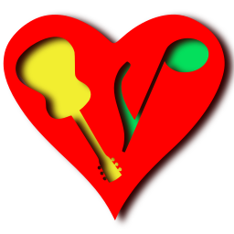

... to play scores
----------------------------------

[https://nootka.sourceforge.io](https://nootka.sourceforge.io/)

**Nootka** is an application to discover and learn classical score notation.  
It helps to understand the rules of reading and writing scores
and helps with developing skills of playing and singing notes from a score.  
The application is free and open source.  
It works under Windows, Linux, Mac and Android.

### Features
- interactive interface to discover the rules of musical notation
- exercises with possibility to create own sets
- accurate method for detecting sung and played sounds and melodies
- natural sound of instruments
- clefs (treble, bass and others) and grand stave
- analyze of results
- different kinds of guitars and theirs tuning
- piano, bandoneon and saxophones (experimental)
- Czech, French, German, Hungarian, Italian, Polish, Spanish, Slovenian and Russian translations

Download and Installation
--------------------------

Here is [download page](https://nootka.sourceforge.io/index.php/download/)  
But **Nootka** is available in installers of many Linux distributions.  
Also in [Google Play Store](https://play.google.com/store/apps/details?id=net.sf.nootka)

Compilation from sources
----------------------------
- [actual state](https://nootka.sourceforge.io/index.php/help/#compile-debug)
    also in **git master** branch
- [stable version](https://nootka.sourceforge.io/index.php/help/#compilation)
    also in **git release** branch

Help
----------------------------

- [Help topics](https://nootka.sourceforge.io/index.php/help)

- [Bug tracker](https://sourceforge.net/p/nootka/bugs/)

- [Feature request](https://sourceforge.net/p/nootka/feature-requests/)

